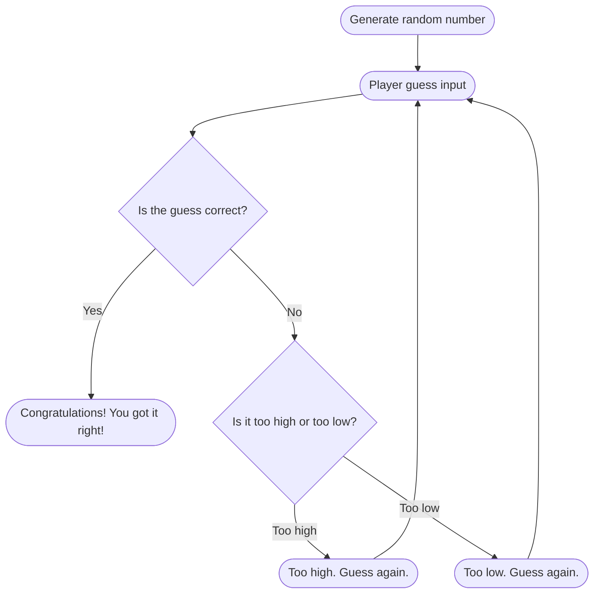

# Number Guessing Game Flowchart

### How it Works
*The process begins with the computer generating a random number. The player inputs a guess, which the game checks to see if it's correct. If the guess is correct, the player wins, and the game ends. If it's incorrect, the game determines if the guess is too high or too low and provides feedback. The player then guesses again, repeating the process until the correct number is guessed.*